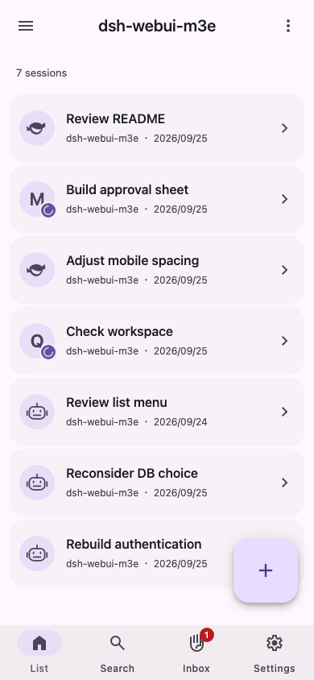
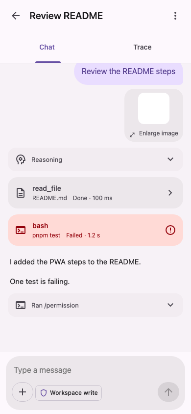
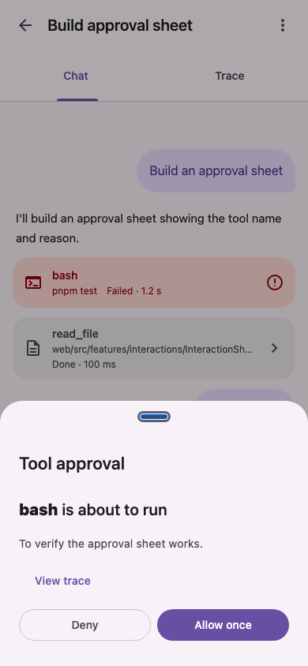
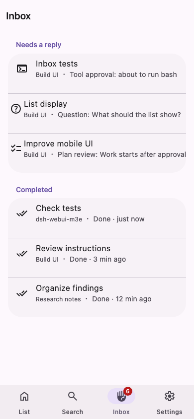

# dsh-webui-m3e

[日本語](README.md) | English | [简体中文](README.zh-CN.md)

A Material 3 Expressive mobile Web UI plugin for DeepSeek Harness (DSH). The UI text is Japanese only.

<p>
  
  
  
  
</p>

The screenshots show translated mock screens. The actual app UI is Japanese only.

> [!NOTE]
> This is a personal project and is not an official DeepSeek product. It is under development and has not yet been tested with a live DSH instance.

## Features

- **Conversations:** Read AI responses, tool results, and reasoning on a phone-sized screen. You can also switch to a chronological trace view.
- **Responses:** Approve tools, answer AI questions, and review plans from a bottom sheet on any screen.
- **Inbox:** See conversations that need a response alongside completed conversations.
- **Composer:** Attach images, get file and command suggestions, and switch models and permission modes.
- **More:** Search conversations, manage DSH settings and API keys, and add the Web app to your home screen.

The existing DSH interface remains available. You can choose which interface to use on each device.

## Requirements

- DeepSeek Harness 0.1.5-rc.3 (startup and connection have been verified with this version)
- Node.js 22 or later and pnpm for building

## Installation

```bash
git clone https://github.com/AliceSaikawa/dsh-webui-m3e.git
```

```bash
cd dsh-webui-m3e && pnpm install && pnpm build && pnpm pack
```

Install the resulting `dsh-webui-m3e-<version>.tgz` in DSH, then restart DSH. Set `--profile` to the profile running the DSH Web UI.

```bash
dsh plugin --profile web add file:/path/to/dsh-webui-m3e-<version>.tgz
```

When reinstalling, increment `version` in `package.json` before rebuilding the package. Otherwise, DSH may continue to use the old files.

## Usage

1. Sign in once through the usual DSH interface (`http://<host>/`).
2. Open `http://<host>/m3e/`.
3. On iPhone, choose “Add to Home Screen” from Safari's Share menu to open it like an app.

### Switching interfaces

Choose which interface to use on this device with any of the following options. Your choice is saved separately on each device.

- In the usual interface: `設定 → 一般 → この端末で M3E の画面を使う` (Settings → General → Use the M3E interface on this device)
- In this interface: `設定 → 今の画面に戻す` (Settings → Switch back to the classic interface)
- Add `?ui=m3e` or `?ui=classic` to the URL

If either interface fails to load, open `http://<host>/?ui=classic` to return to the usual interface.

## Notes

- The UI text is Japanese only.
- This plugin bundles internal DSH libraries (`@deepseek-ai/cordis` and `@deepseek-ai/dsh-client-store`), so it may not work with every DSH version.
- During development, the UI is checked with mock data instead of a live DSH instance. See [docs/development.md](docs/development.md) for the development workflow and architecture.

## License

MIT. See [LICENSE](LICENSE).
