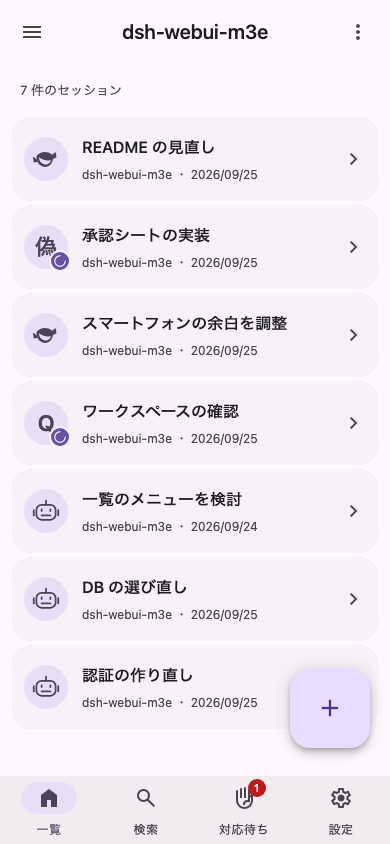
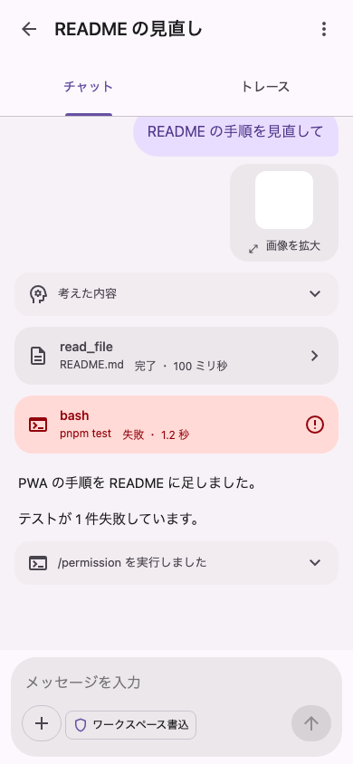
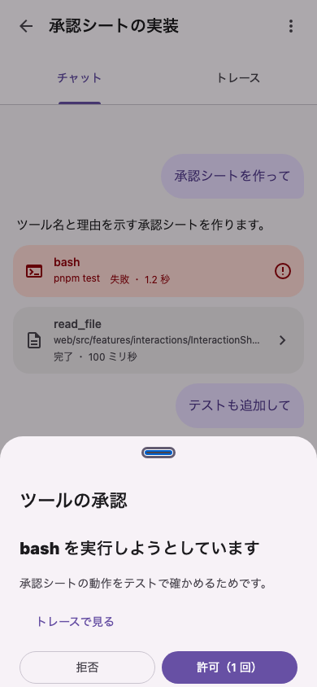
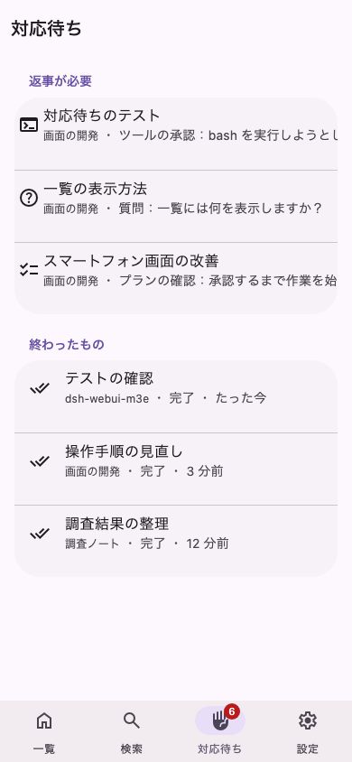

# dsh-webui-m3e

DeepSeek Harness（DSH）を、スマートフォンで使いやすい Material 3 Expressive の画面で操作するためのプラグインです。

A Material 3 Expressive mobile Web UI plugin for DeepSeek Harness (DSH). The UI text is Japanese only.

<p>
  
  
  
  
</p>

> [!NOTE]
> 個人のプロジェクトで、DeepSeek の公式のものではありません。開発中で、実物の DSH とつないだ確認はまだ済んでいません。

## できること

- **会話**：AI とのやり取り、ツールの実行結果、考えた内容を、スマートフォンの幅で読めます。記録を時間の順に並べた「トレース」にも切り替えられます。
- **返事**：ツールの承認、AI からの質問、プランの確認に、どの画面にいても下からのシートで答えられます。
- **対応待ち**：返事が必要な会話と、終わった会話をまとめて見られます。
- **入力**：画像の添付、ファイルやコマンドの候補、モデルや権限の切り替えができます。
- **そのほか**：会話の検索、DSH の設定と API キーの登録、ホーム画面に追加して使う Web アプリ

今の DSH の画面はそのまま残ります。端末ごとに、どちらの画面を使うかを選べます。

## 必要なもの

- DeepSeek Harness 0.1.5-rc.3（この版で起動と接続を確かめています）
- ビルドのための Node.js 22 以上と pnpm

## 入れ方

```bash
git clone https://github.com/AliceSaikawa/dsh-webui-m3e.git
```

```bash
cd dsh-webui-m3e && pnpm install && pnpm build && pnpm pack
```

できた `dsh-webui-m3e-<版>.tgz` を DSH に入れ、DSH を再起動します。`--profile` には、DSH の Web 画面を動かしているプロファイルを指定してください。

```bash
dsh plugin --profile web add file:/path/to/dsh-webui-m3e-<版>.tgz
```

入れ直すときは、`package.json` の `version` を上げてから作り直してください。同じ版のままだと、古いファイルが使われ続けます。

## 使い方

1. いつもの DSH の画面（`http://<host>/`）で、一度ログインします。
2. `http://<host>/m3e/` を開きます。
3. iPhone では、Safari の共有メニューから「ホーム画面に追加」すると、アプリのように開けます。

### 画面を切り替える

この端末でどちらの画面を使うかは、次のどれかで選べます。選んだ内容は端末ごとに保存されます。

- いつもの画面の「設定 → 一般 → この端末で M3E の画面を使う」
- この画面の「設定 → 今の画面に戻す」
- URL に `?ui=m3e` か `?ui=classic` を付けて開く

どちらかの画面がうまく開かないときは、`http://<host>/?ui=classic` を開くと、いつもの画面に戻れます。

## 注意

- 画面の文言は日本語だけです。
- DSH の内部のライブラリ（`@deepseek-ai/cordis`、`@deepseek-ai/dsh-client-store`）を同梱しているので、DSH の版によっては動かないことがあります。
- 開発中は、実物の DSH の代わりに偽のデータで確かめています。開発の方法と仕組みは [docs/development.md](docs/development.md) にあります。

## ライセンス

MIT です。[LICENSE](LICENSE) を見てください。
