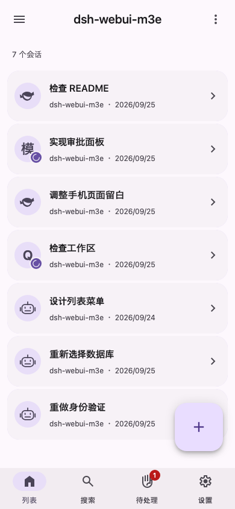
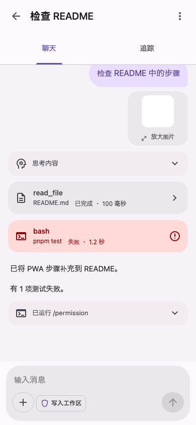
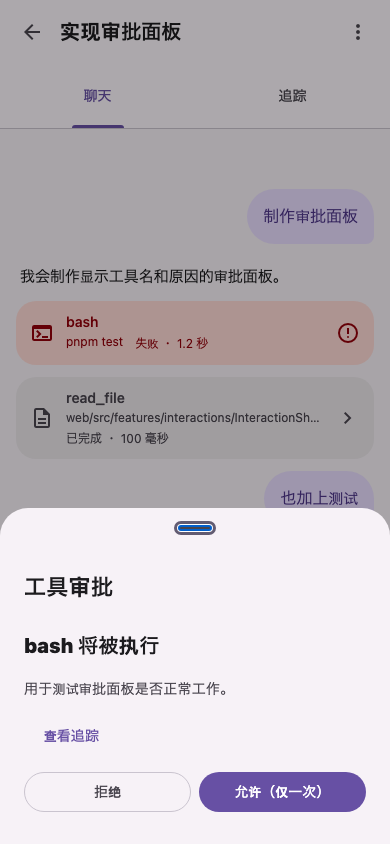
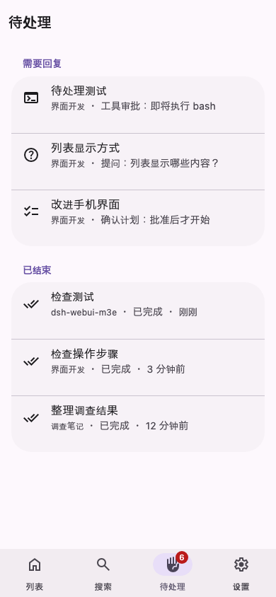

# dsh-webui-m3e

[日本語](README.md) | [English](README.en.md) | 简体中文

这是一个插件，让你通过适合智能手机使用的 Material 3 Expressive 界面操作 DeepSeek Harness（DSH）。界面文字仅提供日语。

<p>
  
  
  
  
</p>

这些截图展示经过翻译的模拟画面；实际应用界面仍仅提供日语。

> [!NOTE]
> 这是个人项目，并非 DeepSeek 官方产品。项目仍在开发中，尚未完成与实际 DSH 连接的验证。

## 功能

- **会话**：在手机屏幕上阅读与 AI 的对话、工具执行结果和思考内容，也可以切换到按时间顺序排列记录的「トレース」（追踪）视图。
- **回复**：无论当前在哪个页面，都可以通过底部弹出的面板审批工具、回答 AI 的提问或确认计划。
- **待处理事项**：集中查看需要回复的会话和已结束的会话。
- **输入**：支持附加图片、显示文件和命令候选项，以及切换模型和权限。
- **其他功能**：搜索会话、配置 DSH 并登记 API 密钥，以及将网页添加到主屏幕后作为 Web 应用使用。

DSH 原有的界面会保留。你可以在每台设备上分别选择使用哪个界面。

## 环境要求

- DeepSeek Harness 0.1.5-rc.3（已使用此版本验证启动和连接）
- 用于构建的 Node.js 22 或更高版本，以及 pnpm

## 安装

```bash
git clone https://github.com/AliceSaikawa/dsh-webui-m3e.git
```

```bash
cd dsh-webui-m3e && pnpm install && pnpm build && pnpm pack
```

将生成的 `dsh-webui-m3e-<version>.tgz` 安装到 DSH，然后重启 DSH。请通过 `--profile` 指定运行 DSH Web 界面的配置档案。

```bash
dsh plugin --profile web add file:/path/to/dsh-webui-m3e-<version>.tgz
```

重新安装时，请先提高 `package.json` 中的 `version`，再重新构建。若版本号不变，旧文件可能会继续被使用。

## 使用方法

1. 先在常用的 DSH 界面（`http://<host>/`）登录一次。
2. 打开 `http://<host>/m3e/`。
3. 在 iPhone 上，可以通过 Safari 的分享菜单选择“添加到主屏幕”，像应用一样打开。

### 切换界面

你可以通过以下任一方式选择这台设备使用的界面。所选设置会分别保存在每台设备上。

- 在原有界面中选择「設定 → 一般 → この端末で M3E の画面を使う」（设置 → 常规 → 在此设备上使用 M3E 界面）
- 在本界面中选择「設定 → 今の画面に戻す」
- 在 URL 后附加 `?ui=m3e` 或 `?ui=classic` 后打开

如果某个界面无法正常打开，请访问 `http://<host>/?ui=classic`，返回原有界面。

## 注意事项

- 界面文字仅提供日语。
- 插件随附 DSH 的内部库（`@deepseek-ai/cordis`、`@deepseek-ai/dsh-client-store`），因此可能无法在某些 DSH 版本上运行。
- 开发期间使用模拟数据代替实际 DSH 进行验证。开发方法和工作原理见 [docs/development.md](docs/development.md)。

## 许可证

采用 MIT 许可证。详见 [LICENSE](LICENSE)。
